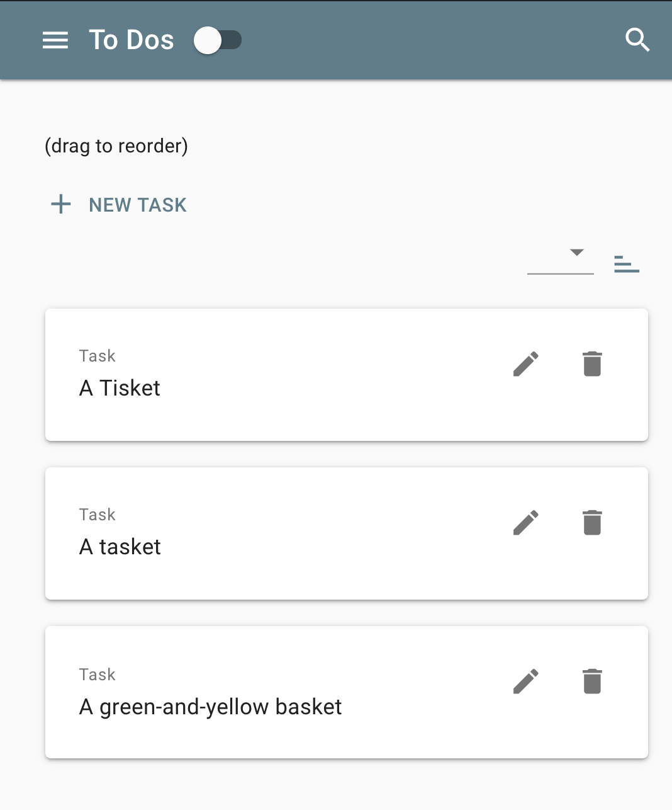
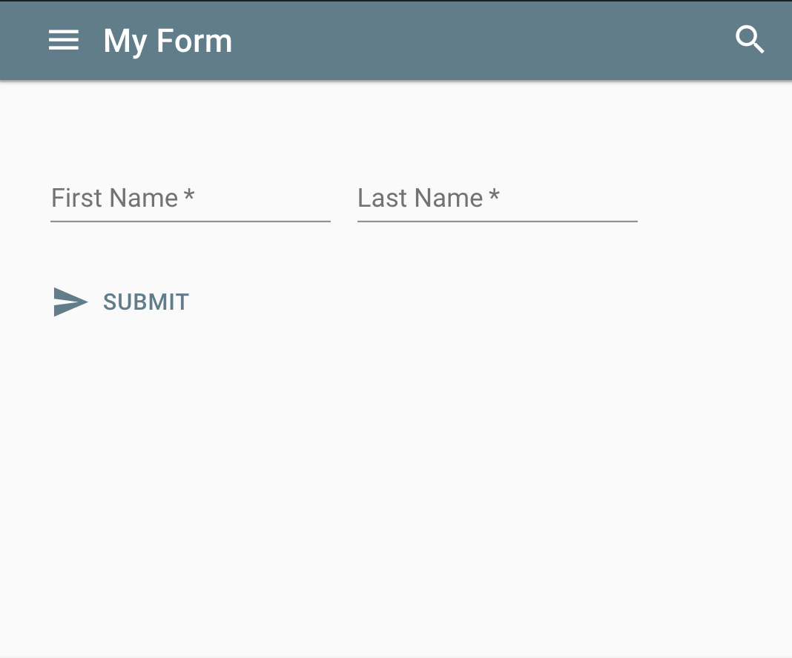
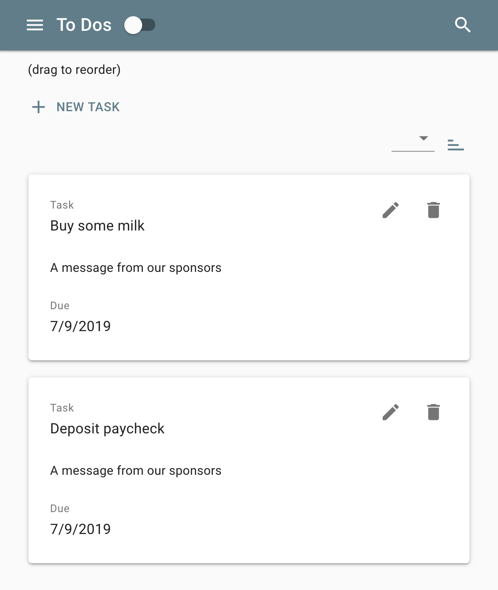
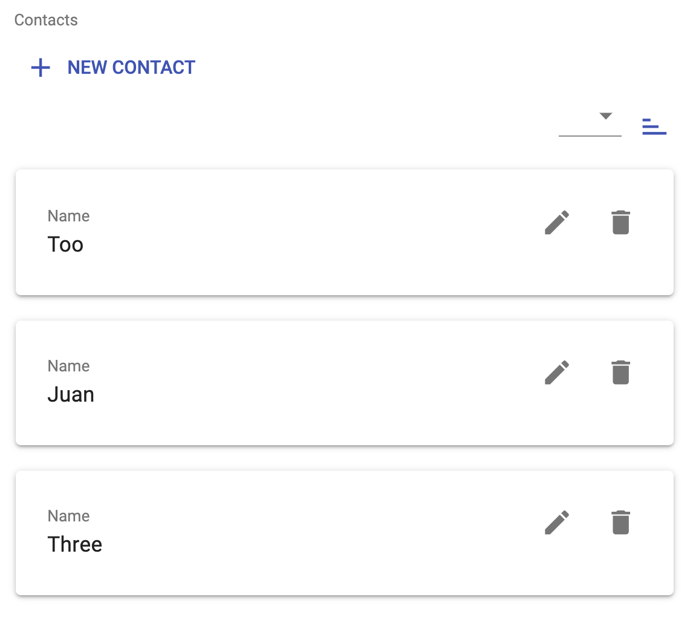

####
Live Examples
####

To-Do List App
--------------

.. raw:: html

   

See it live at: https://codesandbox.io/s/o584w8k67z

Basic Form App with a Submit Button
-----------------------------------

.. raw:: html

   

See it live at: https://codesandbox.io/s/y2r3klwzyj

Basic Form App that Posts a Request to an API
---------------------------------------------

This example builds on the previous one, with the addition of a **custom Action component** 
that makes an HTTP post request to an API endpoint. 

When you test it out, you can see in the 
devtools network tab that it successfully posts a request. Even though it uses incorrect data
and returns an error, it demonstrates succesful implementation of a custom Action component in MSON.

.. raw:: html

   

See it live at: https://codesandbox.io/s/mson-07-simple-app-w-custom-action-l5mij

Another To-Do List App with an Added Text Field
-----------------------------------------------

This example is just like the Todo List app above, but with an added Text field.
A Text field just *shows* simple text to the user. It has full markdown support,
so there are lots of uses for the Text component.

Note: The Text component being used as a field is not to confused with a TextField component.
A TextField component is for the user to input text into a form, whereas the Text component is
used to display text to the user.

.. raw:: html

   

See it live at: https://codesandbox.io/s/mson-02-to-do-list-zp179

Simple Orderable Contact List
-----------------------------

This contact list app, which uses MSON's CollectionField component
was made into an orderable list with one simple parameter:

.. code-block:: none

  forbidOrder: false,

.. raw:: html

   

Take a look at it here: https://codesandbox.io/s/mson-012-orderable-collection-list-qkmyy

Simple App with a Custom PouchDB Store 
--------------------------------------

Certain MSON components store information in stores. Stores are MSON components that know how to
store and retrieve data from various places. For instance, the LocalStorageStore saves and retrieves
information on the user's system, in the browser's localStorage database. There is also a store which
saves information in a Firestore database.

This example app uses a custom (beta) version of a PouchDB store which saves data into PouchDB, a local database which
easily replicates with CouchDB and Couchbase.

https://codesandbox.io/s/mson-06-simple-app-w-pouch-store-zvuwn

Experimental: Nested CollectionField Components
-----------------------------------------------

https://codesandbox.io/s/mson-03-nested-collectionfields-0p3z1

Example That Uses the MSON ListField Component
----------------------------------------------

https://codesandbox.io/s/mson-04-dictionaryentry-with-listfield-meanings-nbkq9

Example that Implements a MSON CompositeField
---------------------------------------------

https://codesandbox.io/s/mson-05-translations-listfield-je6dc

Custom MSON Action Component with a Custom Button
-------------------------------------------------

https://codesandbox.io/s/mson-08-custom-action-with-custom-button-ykpij

An Orderable CollectionField Example
------------------------------------

https://codesandbox.io/s/mson-012-orderable-collection-list-qkmyy

Simple Form with Event Handler
------------------------------

This example, one of Geoff's creations, handles form events a little differently, using the 
MSON component's `on` function to listen for the submit event and then give an alert to the user.

https://codesandbox.io/s/x7z488p18p

A Couple Other Examples (Misc)
------------------------------

https://bl.ocks.org/redgeoff/a69ca781d143277fcda341b5de9423ca

https://bl.ocks.org/redgeoff/5cb1118ff2397bf8879f7779c02d7eee